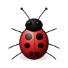
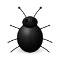
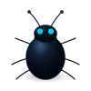
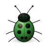

# Pet packs

A **pet pack** is a directory of vector SVG poses plus a `pack.toml` manifest.
WayPenguin ships one built-in pack, [`tux-alpha/`](tux-alpha/), and can load
additional packs from disk at runtime.

## Directory layout

```
my-pet/
├── pack.toml        # manifest (required)
├── walker.svg       # required activity
├── faller.svg       # optional activities …
├── climber.svg
├── tumbler.svg
├── floater.svg
├── action0.svg
├── angel.svg
└── splatted.svg
```

## `pack.toml`

```toml
[pack]
id          = "my-pet"        # unique slug, must equal the directory name
name        = "My Pet"        # display name for the settings app
author      = "you"
license     = "CC-BY-SA-4.0"
version     = "1.0.0"
description = "A short blurb."
scale       = 1.0             # optional: pet size multiplier (0.1–3.0, default: 1.0)

[activities]
walker   = "walker.svg"       # required — used as the fallback for omitted activities
faller   = "faller.svg"       # everything else is optional
climber  = "climber.svg"
tumbler  = "tumbler.svg"
floater  = "floater.svg"
action0  = "action0.svg"
angel    = "angel.svg"
splatted = "splatted.svg"
```

### Configuration

#### `scale` (optional, default: 1.0)

Controls the pet's window size and rendered texture scale. The base pet size is 90 pixels;
a `scale` of 1.5 renders a 135×135 px pet, while 0.7 renders 63×63 px.

**Valid range:** 0.1–3.0. Values outside this range are clamped.

## Drawing the SVGs

- Use a **square `0 0 100 100` viewBox** and a **transparent background**.
  The renderer rasterises each pose at the display size, so use real vector
  shapes (`<path>`, `<ellipse>`, …) — not a grid of 1×1 rectangles.
- Keep art inside the viewBox; the daemon fits it into the pet window.
- Poses are currently **single-frame** (one static pose per activity).

### Activities

| activity   | when it plays                    |
|------------|----------------------------------|
| `walker`   | walking / running / moving (also the fallback) |
| `faller`   | falling                          |
| `climber`  | climbing a wall                  |
| `tumbler`  | tumbling / landing               |
| `floater`  | drifting down                    |
| `action0`  | idle / sleep / ambient action    |
| `angel`    | expired, floating away           |
| `splatted` | expired, splat                   |

Only `walker` is required; any activity you leave out falls back to `walker`.

## Installing a pack

Copy the pack directory into the user pets folder:

```
$XDG_DATA_HOME/waypenguin/pets/<id>/      # or ~/.local/share/waypenguin/pets/<id>/
```

WayPenguin discovers packs there on start (selection UI in the settings app is
planned). The built-in `tux-alpha` pack is always available as the default.

## Regenerating `tux-alpha`

The Tux poses are generated from a small part-kit:

```
python3 tux-alpha/generate_poses.py    # rewrites tux-alpha/*.svg
```

---

## Built-in packs

All packs below are compiled into the binary.  
Each thumbnail shows the `walker` pose (the default / fallback activity).

<table>
<tr>
  <td align="center">
    <br>
    <b>tux-alpha</b><br>
    <sub>Linux Tux — the default</sub>
  </td>
  <td align="center">
    <br>
    <b>ladybug-classic</b><br>
    <sub>Cinematic red ladybug</sub>
  </td>
  <td align="center">
    <br>
    <b>beetle-void</b><br>
    <sub>Matte obsidian beetle</sub>
  </td>
</tr>
<tr>
  <td align="center">
    <br>
    <b>beetle-azure</b><br>
    <sub>Dark navy, glowing cyan eyes</sub>
  </td>
  <td align="center">
    <br>
    <b>beetle-jade</b><br>
    <sub>Iridescent emerald beetle</sub>
  </td>
  <td align="center">
    <br>
    <b>beetle-gold</b><br>
    <sub>Cinematic amber-gold beetle</sub>
  </td>
</tr>
</table>

---

## Selecting a pack

### Command-line flags

| Flag | Short | Description |
|------|-------|-------------|
| `--list` | `-l` | Print all available packs and exit |
| `--pack <id>` | `-p` | Run with a specific pack |
| `--data <path>` | `-d` | Set the packs directory to scan |
| `--count <n>` | `-n` | Number of pet instances (default: 5) |
| `--scale <n>` | `-s` | Pet size multiplier (0.1–3.0, overrides pack scale) |

```sh
# list all packs compiled in (or found in the user packs dir)
waypenguin-daemon --list

# run with the jade beetle
waypenguin-daemon --pack beetle-jade

# run with 50% smaller pets
waypenguin-daemon --scale 0.5

# run with 2x larger pets
waypenguin-daemon --scale 2.0

# list packs from a custom directory
waypenguin-daemon --data /path/to/my/packs --list

# combine: custom packs dir + specific pack + 3 pets
waypenguin-daemon -d /path/to/my/packs -p my-custom-pet -n 3
```

### Environment variables

Environment variables are applied before the first pack load and can be used
in place of (or together with) the flags above.

| Variable | Description |
|----------|-------------|
| `WAYPENGUIN_PACK` | Select a pack by id |
| `WAYPENGUIN_PETS_DIR` | Override the user packs directory |

```sh
WAYPENGUIN_PACK=beetle-azure waypenguin-daemon
WAYPENGUIN_PETS_DIR=~/my-packs WAYPENGUIN_PACK=my-pet waypenguin-daemon
```

CLI flags take precedence over the corresponding environment variables.
